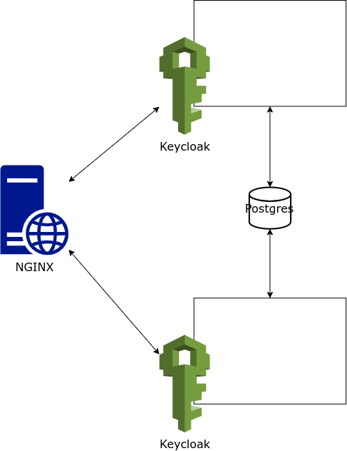

# Portal de Seguridades
Este es el levantamiento mediante dockers tener un servidor NGINX que balancea dos servidores de Keycloak, que a su vez se conectan a una base de datos Postgres.

Y configurado para que funcione en un ambiente de desarrollo y por tal motivo tiene una configuración de recursos mínimos.

## Arquitectura propuesta

## Servidores
### NGINX <engine-ex>
Este servidor Web que tiene las funciones de:    
- Equilibrador de carga
- Servidor de archivos estáticos
- Servidor de seguridad
- Servidor de cache
- Servidor de proxy
- Servidor de redireccionamiento
- Servidor de certificados
- Servidor de log
- Servidor de moni

De la que se va a utilizar la función de equilibrio de carga para balancear dos servidores de Keycloak.

Se puede tener más información en [NGINX](https://www.nginx.com/) y en [NGING en español](https://kinsta.com/es/
base-de-conocimiento/que-es-nginx/) 

Y para su configuración se utiliza la siguiente codificación:

```yml
  nginx:
    container_name: nginx
    mem_limit: 128m
    mem_reservation: 32M
    cpus: 0.5
    image: nginx:alpine
    volumes:
      - ./nginx_setup/nginx.conf:/etc/nginx/conf.d/default.conf
    ports:
      - "8000:8000"
    depends_on:
      - keycloakB
      - keycloakA      
    networks:
      - keycloak-net
```

Y para la configuracion de los servidores de keycloak se utiliza el siguiente codigo:

```ini
upstream backend {
    server keycloakA:8080 fail_timeout=2s;
    server keycloakB:8080 fail_timeout=2s;
}

server {
    listen       8000;
    server_name  localhost;

    location / {
        proxy_set_header    Host               $host;
        proxy_set_header    X-Real-IP          $remote_addr;
        proxy_set_header    X-Forwarded-For    $proxy_add_x_forwarded_for;
        proxy_set_header    X-Forwarded-Host   $host;
        proxy_set_header    X-Forwarded-Server $host;
        proxy_set_header    X-Forwarded-Port   $server_port;
        proxy_set_header    X-Forwarded-Proto  $scheme;

        proxy_pass              http://backend;
        proxy_connect_timeout   2s;

        proxy_buffer_size          128k;
        proxy_buffers              4 256k;
        proxy_busy_buffers_size    256k;
    }
}
```    

### Keycloak
El servidor de seguridades keycloak es para la version 21.1.1 y se utiliza la siguiente configuración:

```yml
keycloakA:
    container_name: keycloakA
    ## configuration recursos
    mem_limit: 512m
    mem_reservation: 128M
    cpus: 2
    build: keycloak_build
    image: keycloak:21.1.1
    ## image: quay.io/keycloak/keycloak:21.1.1    
    ## restart: always
    environment:
      ## base de datos
      - KC_DB_PASSWORD=postgres123 ## clave de base de datos
      - KC_DB_SCHEMA=public ## esquema de base de datos
      - KC_DB_URL_DATABASE=keycloak ## base de datos   
      - KC_DB_URL_HOST=postgres ## host de base de datos
      - KC_DB_URL_PORT=5432 ## puerto de base de datos
      - KC_DB_USERNAME=postgres ## usuario de base de datos
      - KC_DB=postgres ## tipo de base de datos

      - KC_HOSTNAME_STRICT_HTTPS=false
      - KC_HOSTNAME_STRICT=false
      - KC_HTTP_ENABLED=true
      - KC_PROXY=edge
      - KEYCLOAK_ADMIN_PASSWORD=admin123
      - KEYCLOAK_ADMIN=admin
      - KEYCLOAK_FRONTEND_URL="http://localhost:8000/auth/" ## URL de acceso          
      - PROXY_ADDRESS_FORWARDING=true
      - CACHE_OWNERS_COUNT=2
      - CACHE_OWNERS_AUTH_SESSIONS_COUNT=2
      - JGROUPS_DISCOVERY_PROTOCOL=JDBC_PING
      - JGROUPS_DISCOVERY_PROPERTIES="datasource_jndi_name=java:jboss/datasources/KeycloakDS,initialize_sql=\"CREATE TABLE IF NOT EXISTS JGROUPSPING (own_addr varchar(200) NOT NULL, cluster_name varchar(200) NOT NULL, created TIMESTAMP DEFAULT CURRENT_TIMESTAMP, ping_data BYTEA, constraint PK_JGROUPSPING PRIMARY KEY (own_addr, cluster_name))\",remove_all_data_on_view_change=true"
    depends_on:
      - postgres      
    ports:
      - 8082:8080
    networks:
      - keycloak-net
    command:
      - start
```

y que tiene un dockerfile para la configuración de los SPI y de los temas de keycloak

```dockerfile
FROM quay.io/keycloak/keycloak:21.1.1
LABEL version="1.0"
LABEL description="Custom Keycloak 21 Image"
WORKDIR /opt/keycloak
RUN /opt/keycloak/bin/kc.sh build
ENTRYPOINT ["/opt/keycloak/bin/kc.sh"]
```

### Postgres
La base de datos postgres que se utiliza para el almacenamiento de datos de keycloak y para ser lanzado se usa la siguiente instrucción:

```yml
postgres:
    container_name: postgresX    
    mem_limit: 128m
    mem_reservation: 32M
    cpus: 0.5
    image: postgres:14.7    
    environment:
      - POSTGRES_USER=postgres
      - POSTGRES_PASSWORD=postgres123
      - POSTGRES_DB=keycloak
    ports:
      - 5432:5432
    volumes:
      - postgres_data:/var/lib/postgresql/data
    networks:
      - keycloak-net
    command:
      - "postgres"
      - "-c"
      - "max_connections=1000" ## maximo de conexiones necesario para funcionar con keycloak para desarrollo
      - "-c"
      - "max_prepared_transactions=64" ## maximo de transacciones preparadas necesario para funcionar con keycloak para desarrollo
```        

---

<o.velez>

**Creado: 2024-04-25**
